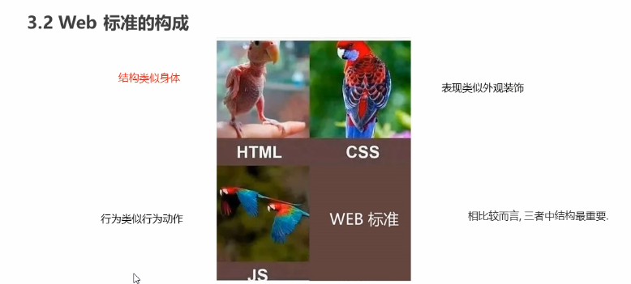

# 前端基础概念

## 网页

网站是指在因特网上根据一定的规则，使用HTML等制作的用于展示特定内容的网页集合。

网页是网站中的一“页”，通常是HTML格式的文件，他要通过浏览器来阅读。

网页是构成网站的基本元素，它通常由图片、链接、文字、声音、视频等元素组成

## HTML

HTML：指的是超文本标记语言（Hyper Text Markup Language）(超越文本的限制，能添加图像，音频，视频等；超链接的实现)

## 网页形成

网页是由网页元素组成的，这些元素是利用html标签描述出来，然后通过浏览器解析来显示给用户的

## 浏览器与内核

IE浏览器(Trident)

火狐(Gecko)

Safari (Webkit)

Opera（Blink）

谷歌浏览器(chrome) （Blink）

浏览器内核：本质是渲染引擎，负责读取网页内容，整理讯息，计算网页的显示方式并显示页面。

## Web标准

统一展示内容

主要包括结构（structure）、表现（presentation）和行为（behavior）三个方面

结构（structure）：对网页元素进行整理和分类

表现（presentation）：表现用于设置网页元素的版式、颜色、大小、等外观样式

行为（behavior）：网页模型的定义及交互的编写

