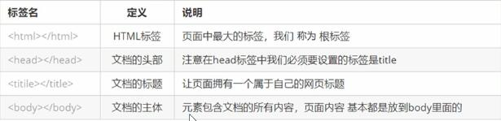

# HTMl标签

## 1、概述

```html
<html></html>
<br/>
```

标签：1、<>包含关键词

​		  2、成对出现：开始标签，结束标签（双标签），<html>  </html>

​          3、（单标签）<br/>

包含关系(父子关系)

```html
<html>
    <title></title>
</html>
```

并列关系(兄弟关系)

```html
<html>
    <title></title>
    <body></body>
</html>
```

骨架标签

```html
<html>
    <head>
        <title>头标题</title>
    </head>
    <body>
        主体
    </body>
    
</html>
```



开发工具预设中的骨架标签（下面的标签为自动生成）

```html
<!DOCTYPE html>
<html lang="en">
<head>
    <meta charset="UTF-8">
    <title>Title</title>
</head>
<body>

</body>
</html>
```


## 2、文档类型声明标签

声明HTML版本，其位于文档中最前面的位置，不属于html标签主体

```html
<!DOCTYPE html>
```

## 3、lang 语言种类

定义当前的html文档显示语言

```html
<html lang="en"></html> 
```

```html
<html lang="zh-CN"></html>
```

## 4、charset字符集

```html
<meta charset="UTF-8">
```

字符集是多个字符的集合在<head>中通过<meta>的charset属性来规定HTML文档使用的字符编码（UTF-8）
